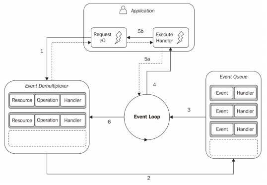
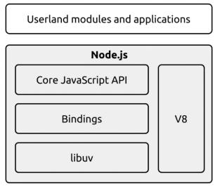
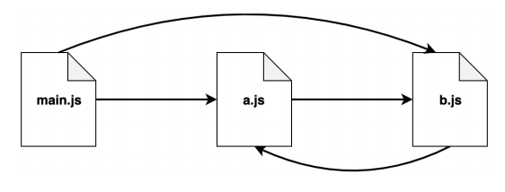
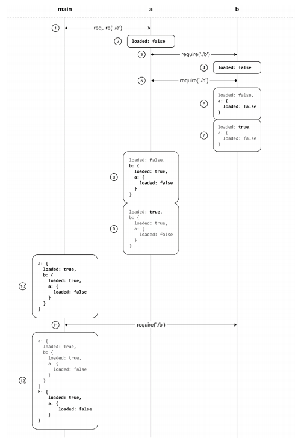

# Node.js

## 安装

 - 官方下载地址：https://nodejs.org/zh-cn/

 - 下载LTS （长期维护版本）

 - 安装目录放在非中文不含空格的目录即可

## 什么是I/O操作

 - Input/Output (输入/输出) 简称I/O

 - 输入/输出一般指的的是访问磁盘或网络，注意访问内存不算I/O !

 - I/O操作是计算机操作中速度最慢的一类

 - I/O操作一般不太占CPU资源

## 工作原理

 - 市面上大部分编程语言对I/O操作都是阻塞的，下面以网络请求为例

    


 - Node.js的I/O操作是异步的，或者说Node.js的I/O操作是非阻塞的，下面还是以网络请求为例

    

    ```
    //上图的伪代码实现，尝试体会
    //这种方式叫做busy-waiting

    resources = [socketA,socketB,socketC]

    while(! resources.isEmpty()){
        for(resource of resources){
            //尝试读取
            data = resource.read()
            if(data === NO_DATA_AVAILABLE){
                //目前没有数据可以读取
                continue
            }

            if(data === RESOURCE_CLOSED){
                //资源已关闭，把它从列表中移除
                resources.remove(i)
            }else{
                //收到了数据，处理该数据
                consumeData(data)
            }
        }
    }
    ```

 - 事件多路分离

    上面的busy-waiting绝对不是处理非阻塞资源的理想方式，好在目前大多数操作系统，都提供了一种原生机制，能够高效处理并发式的非阻塞资源。这指的就是同步事件多路分离器(synchronus event demultiplexer)。
    下面使用事件多路分离技术实现刚才的busy-waiting方案,注意是伪代码实现。

    ```

    resources = [socketA,socketB,socketC]

    // 注意： demultiplexer.watch(resources) 是同步阻塞的，这是操作系统支持的
    while(events = demultiplexer.watch(resources)){
        // 事件轮询 event-loop
        for(event of events){
            // 这项读取操作绝不会阻塞，他总是能返回数据
            data = event.resource.read()
            if(data === RESOURCE_CLOSED){
                //资源已关闭，把它从列表中移除
                demultiplexer.unwatch(event.resource)
            }else{
                //收到了数据，处理该数据
                consumeData(data)
            }
        }
    }

    ```
 - 事件轮询 Event-loop

    下面的图是解释在Node.js中如何实现事件轮询的，同时也解释了如何与事件多路分离相配合

    


## Node.js的宏观结构

 - 结构图
   
   

## 模块系统

 - revealing module模块（闭包-立即执行函数）

    典型的例子如Jquery

    ```
    const myModule = (function(){
        const _foo = () => {}
        const _bar = []

        const exported = {
            foo:_foo,
            bar:_bar
        }

        return exported
    })()

    console.log(myModule)
    console.log(myModule._bar,myModule.bar)
    ```

 - CommonJS

    CommonJs是首个内置于Node.js平台的模块系统。

    - require 导入

        自己实现require

        ```
        function loadModule(filename,module,require){
            const wrappedSrc = 
            `
            (function(module,exports,require){
                ${fs.readFileSync(filename,"utf8")}
            })(module,module.exports.require)
            `
            eval(wrappedSrc)
        }

        function require(moduleName){
            console.log("require invoked for module:${moduleName}")
            const id = require.resolve(moduleName)
            if(require.cache[id]){
                return require.cache[id].exports
            }
            //模块的元数据
            const module = {
                exports:{},
                id
            }
            //更新缓存
            require.cache[id] = module

            //载入模块
            loadModule(id,module,require)
            //返回导出的变量
            return module.exports
        }

        require.cache = {}

        require.resolve = (moduleName) => {
            /*
                根据moduleName解析出完整的模块id
                这块是require解决“依赖地狱”的核心
            */
        }

        ```

    - exports 与 module.exports 导出

        许多刚接触Node.js的开发者，经常搞不清exports 和 module.exports之间的区别。

        ```
        //正确写法
        exports.hello = () => {
            console.log("hello")
        }

        //错误写法
        exports =  () => {
            console.log("hello")
        }

        ```

        ```
        module.exports = () => {
            console.log("hello")
        }
        ```
     
    
    - CommonJS如何处理“依赖地狱”情况

        

        ```
        //a.js

        exports.loaded = false
        const b = require("./b")
        module.exports = {
            b,
            loaded:true
        }

        ```

        ```
        //b.js
        exports.loaded = false
        const a = requre("./a")
        module.exports = {
            a,
            loaded:true
        }
        ```

        ```
        //问题:下面打印的结果是什么

        const a = require("/a")
        const b = require("/b")
        console.log("a->",JSON.stringify(a,null,2))
        console.log("b->",JSON.stringify(b,null,2))  
        ```

        ```
        //打印结果
        a-> {
            loaded:true,
            b:{
                loaded:true,
                a:{
                    loaded:false
                }
            }
        }

        b-> {
            loaded:true,
            a:{
                loaded:false
            }
        }
        ```

        图解

        


        总结：虽然CommonJS可以支持“依赖地狱”的情况，但是运行的结果取决于加载的顺序，这对于大型项目有一定的影响。

 - ESM

## 一个基础的HTTP服务器

 让我们先从服务器模块开始。在你的项目的根目录下创建一个叫server.js的文件，并写入以下代码：

 ```
    var http = require("http");

    http.createServer(function(req, resp) {
        resp.writeHead(200, {"Content-Type": "text/plain"});
        resp.write("Hello World");
        resp.end();
    }).listen(3000,() => console.log("server starting ... "));
 ```
 
 用这样的代码也可以达到同样的目的：

 ```
    var http = require("http");

    function onRequest(req, resp) {
        resp.writeHead(200, {"Content-Type": "text/plain"});
        resp.write("Hello World");
        resp.end();
    }
    http.createServer(onRequest).listen(3000,() => console.log("server starting ... "));
 ```

 你刚刚完成了一个可以工作的HTTP服务器。为了证明这一点，我们来运行并且测试这段代码。首先，用Node.js执行你的脚本：

 ```
    node server.js
 ```

 接下来，打开浏览器访问http://localhost:3000，你会看到一个写着“Hello World”的网页。

 接下来我们简单分析一下我们服务器代码中剩下的部分，也就是我们的回调函数 onRequest() 的主体部分。

 当回调启动，我们的 onRequest() 函数被触发的时候，有两个参数被传入： request 和 response 。

 - response

     它们是对象，你可以使用它们的方法来处理HTTP请求的细节，并且响应请求（比如向发出请求的浏览器发回一些东西）。

     所以我们的代码就是：当收到请求时，使用 response.writeHead() 函数发送一个HTTP状态200和HTTP头的内容类型（content-type），使用 response.write() 函数在HTTP相应主体中发送文本“Hello World"。

     最后，我们调用 response.end() 完成响应。

 - request

     我们从request获取请求的URL和其他需要的GET及POST参数。

     我们需要的所有数据都会包含在request对象中，该对象作为onRequest()回调函数的第一个参数传递。
     
     但是为了解析这些数据，我们需要额外的Node.JS模块，它们分别是url和querystring模块。


     ```  
     
          http://localhost:3000/a?b=1&c=2

          const urlObj = new URL(`http://localhost:3000${req.url}`);
          urlObj.search             // ?b=1&c=2
          urlObj.pathname           // /a
          urlObj.searchParams       // b=1&c=2

     ```
 
 - 增加路由校验和返回一个html页面

     ```

        var http = require("http");
        var { URL } = require("url")

        // http://localhost:3000/a?b=1&c=2

        http.createServer(function(req, resp) {

            if(req.url === "/favicon.ico"){
                resp.end()
                return
            }

            const urlObj = new URL(`http://localhost:3000${req.url}`);
            console.log("searchParams b " + urlObj.searchParams.get("b") );
            console.log("searchParams c " + urlObj.searchParams.get("c") );
            resp.writeHead(200, {"Content-Type": "text/html;charset=utf-8"});
            resp.write("Hello World");
            resp.write("<br>")
            resp.write("<h1>你好</h1>")
            resp.end();
        }).listen(3000,() => console.log("server starting ... "));

     ```