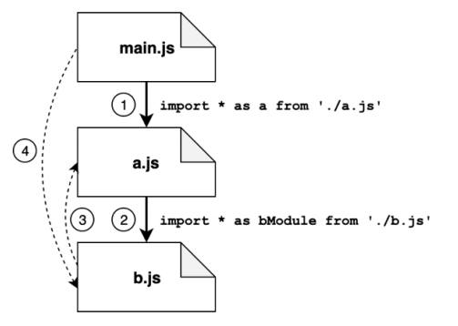
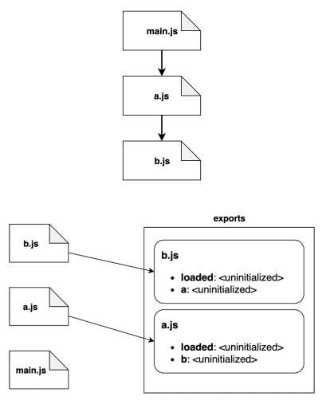
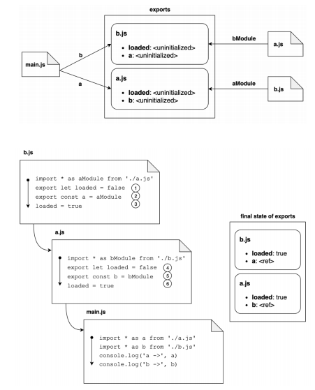
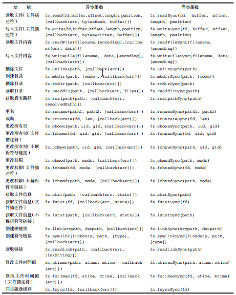
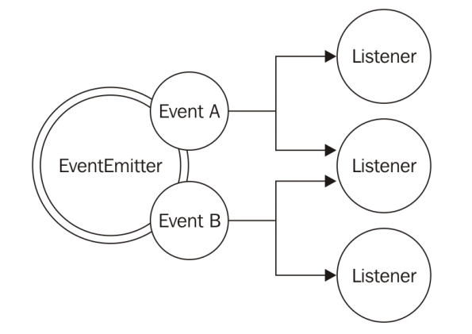
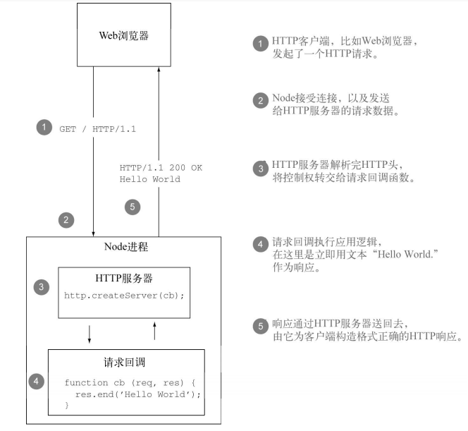
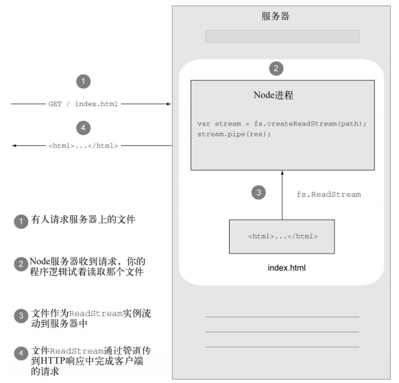

# Node.js

## 安装

 - 官方下载地址：https://nodejs.org/zh-cn/

 - 下载LTS （长期维护版本）

 - 安装目录放在非中文不含空格的目录即可

## 什么是I/O操作

 - Input/Output (输入/输出) 简称I/O

 - 输入/输出一般指的的是访问磁盘或网络，注意访问内存不算I/O !

 - I/O操作是计算机操作中速度最慢的一类

 - I/O操作一般不太占CPU资源

## 工作原理

 - 市面上大部分编程语言对I/O操作都是阻塞的，下面以网络请求为例

    


 - Node.js的I/O操作是异步的，或者说Node.js的I/O操作是非阻塞的，下面还是以网络请求为例

    

    ```
    //上图的伪代码实现，尝试体会
    //这种方式叫做busy-waiting

    resources = [socketA,socketB,socketC]

    while(! resources.isEmpty()){
        for(resource of resources){
            //尝试读取
            data = resource.read()
            if(data === NO_DATA_AVAILABLE){
                //目前没有数据可以读取
                continue
            }

            if(data === RESOURCE_CLOSED){
                //资源已关闭，把它从列表中移除
                resources.remove(i)
            }else{
                //收到了数据，处理该数据
                consumeData(data)
            }
        }
    }
    ```

 - 事件多路分离

    上面的busy-waiting绝对不是处理非阻塞资源的理想方式，好在目前大多数操作系统，都提供了一种原生机制，能够高效处理并发式的非阻塞资源。这指的就是同步事件多路分离器(synchronus event demultiplexer)。
    下面使用事件多路分离技术实现刚才的busy-waiting方案,注意是伪代码实现。

    ```

    resources = [socketA,socketB,socketC]

    // 注意： demultiplexer.watch(resources) 是同步阻塞的，这是操作系统支持的
    while(events = demultiplexer.watch(resources)){
        // 事件轮询 event-loop
        for(event of events){
            // 这项读取操作绝不会阻塞，他总是能返回数据
            data = event.resource.read()
            if(data === RESOURCE_CLOSED){
                //资源已关闭，把它从列表中移除
                demultiplexer.unwatch(event.resource)
            }else{
                //收到了数据，处理该数据
                consumeData(data)
            }
        }
    }

    ```
 - 事件轮询 Event-loop

    下面的图是解释在Node.js中如何实现事件轮询的，同时也解释了如何与事件多路分离相配合

    


## Node.js的宏观结构

 - 结构图
   
   

## 开始使用(创建项目)

 > 打开终端

 > 通过cd命令进入你要创建项目的目录

 > npm init 或者 npm init -y

 > 执行上述命令会自动生成package.json文件

## 模块系统

 - revealing module模块（闭包-立即执行函数）

    典型的例子如Jquery

    ```
    const myModule = (function(){
        const _foo = () => {}
        const _bar = []

        const exported = {
            foo:_foo,
            bar:_bar
        }

        return exported
    })()

    console.log(myModule)
    console.log(myModule._bar,myModule.bar)
    ```

 - CommonJS

    CommonJs是首个内置于Node.js平台的模块系统。

    - require 导入

        自己实现require

        ```
        function loadModule(filename,module,require){
            const wrappedSrc = 
            `
            (function(module,exports,require){
                ${fs.readFileSync(filename,"utf8")}
            })(module,module.exports.require)
            `
            eval(wrappedSrc)
        }

        function require(moduleName){
            console.log("require invoked for module:${moduleName}")
            const id = require.resolve(moduleName)
            if(require.cache[id]){
                return require.cache[id].exports
            }
            //模块的元数据
            const module = {
                exports:{},
                id
            }
            //更新缓存
            require.cache[id] = module

            //载入模块
            loadModule(id,module,require)
            //返回导出的变量
            return module.exports
        }

        require.cache = {}

        require.resolve = (moduleName) => {
            /*
                根据moduleName解析出完整的模块id
                这块是require解决“依赖地狱”的核心
            */
        }

        ```

    - exports 与 module.exports 导出

        许多刚接触Node.js的开发者，经常搞不清exports 和 module.exports之间的区别。

        ```
        //正确写法
        exports.hello = () => {
            console.log("hello")
        }

        //错误写法
        exports =  () => {
            console.log("hello")
        }

        ```

        ```
        module.exports = () => {
            console.log("hello")
        }
        ```
     
    
    - CommonJS如何处理“依赖地狱”情况

        

        ```
        //a.js

        exports.loaded = false
        const b = require("./b")
        module.exports = {
            b,
            loaded:true
        }

        ```

        ```
        //b.js
        exports.loaded = false
        const a = requre("./a")
        module.exports = {
            a,
            loaded:true
        }
        ```

        ```
        //问题:下面打印的结果是什么

        const a = require("/a")
        const b = require("/b")
        console.log("a->",JSON.stringify(a,null,2))
        console.log("b->",JSON.stringify(b,null,2))  
        ```

        ```
        //打印结果
        a-> {
            loaded:true,
            b:{
                loaded:true,
                a:{
                    loaded:false
                }
            }
        }

        b-> {
            loaded:true,
            a:{
                loaded:false
            }
        }
        ```

        图解

        


        总结：虽然CommonJS可以支持“依赖地狱”的情况，但是运行的结果取决于加载的顺序，这对于大型项目有一定的影响。

 - ESM

    ECMAScript模块也叫作ES模块，或简称为ESM。ESM的语法相当简洁，它也支持循环依赖，而且能够异步加载模块（CommonJS的加载是同步的）。
    ESM与CommonJS的一项重要的区别，在于ES模块是静态的（static），也就是说，引入这种模块的那些语句，必须写在最顶层，而且要置于控制语句之外。
    另外，受引用的模块只能使用常量字符串，而不能依赖那种需要在运行期动态求值的表达式。

    比如，我们不能用下面这种方式来引入ES模块

    ```
    if(condition){
        import module1 from 'module1'
    }else{
        import module2 from 'module2'
    }
    ```

    与ES模块相比，之前讲的CommonJS模块，则可以根据条件来引入

    ```
    let module = null
    if(condition){
        module = require("module1")
    }else{
        module = require("module2")
    }
    ```

    这种看似过于严格的ESM规则，其实可以实现CommonJS无法实现的功能，比如优化代码的tree shaking。

    - 在Node.js中如何使用

        Node.js平台中默认会将.js后缀结尾的文件，当成CommonJS语法所写的文件。因此，如果你直接在.js文件中使用ESM语法是会报错的。
        有两种办法，让Node.js解释器把模块当成ESM，而不是CommonJS

        > 把模块文件的后缀名改成.mjs

        > 给最近的上级package.json文件添加名为“type”的字段，并将字段值设为“module”

    - 导出命令 export

        ```
        // a.js
        export const msg = "hello node";

        export const log = str => console.log(str);
        ```

    - 引入命令 import

        ```
        // b.js
        import {msg,log} from "./a.js";

        import {msg,log as myLog} from "./a.js";

        import * as A from "./a.js";
        ```

    - 默认导出  export default

        和CommonJS的module.exports类似，ESM也有只公布一个对象的特性，叫做默认导出 export default。
        一个文件中可以有多个export，但只能有一个default export。

        ```
        // a.js
        export default {
            a:1,
            b:2
        }
        ```

        ```
        // b.js
        import aModule from "./a.js"

        console.log(aModule.a)
        console.log(aModule.b)
        ```
  

    - 模块加载过程

        这个过程可以细分成三个阶段

        - 第一阶段构造[Construction，也叫做刨析（Parsing）]

            寻找所有的引入语句，并递归地从相关文件里加载每个模块内容。

        - 第二阶段实例化（Instantiation）

            针对每个导出的实体，在内存中保留一个带名称的引用，但暂且不给他赋值。另外，还要针对所有的import语句及export语句创建引用，以记录他们之间的依赖关系。这一阶段不执行任何JavaScript代码。

        - 第三阶段执行（Evaluation）

            到了这一阶段，Node.JS终于可以开始执行代码了，这样能够让早前已经实例化的那些实体，获得实际的取值。在这一阶段，Node.JS可以从入口点开始，顺畅地往下执行，因为其中有待解析的那些地方，已经全部解析清楚了。

        简单的说，第一阶段的任务是找到依赖图之中所有的点，第二阶段的任务是在有依赖关系的点之间创建路径，第三阶段则是按照正确的顺序遍历这些路径。

    - 解析循环依赖

        

        ```
        //a.js
        import * as bModule from "./b.js";
        export let loaded = false;
        export const b = bModule
        loaded = true
        ```

        ```
        //b.js
        import * as aModule from "./a.js";
        export let loaded = false;
        export const a = aModule;
        loaded = true;
        ```

        ```
        //main.js
        import * as a from "./a.js";
        import * as b from "./b.js";
        console.log("a->",a)
        console.log("b->",b)
        ```

        ```
        //输出

        a -> <ref *1>[Module]{
            b:[Module]{a:[Circular*1],loaded:true},
            loaded:true
        }

        b -> <ref *1>[Module]{
            a:[Module]{b:[Circular*1],loaded:true},
            loaded:true
        }
        ```

        

        

        

## 正则表达式Regex

 - 声明

    > let expression = /pattern/flags;

    > let expression = new RegExp(pattern,flags)
    ```
    let pattern1 = /at/g
    console.log(pattern1)
    let pattern2 = new RegExg("at","g")
    console.log(pattern2)
    ```
- 使用

    - exec

        调用者：正则表达式

        ```
        let pattern = /o/g;
        console.log(pattern.exec("hello world"));
        console.log(pattern.exec("hello world"));
        ```

    - test

        调用者：正则表达式
        返回布尔值：true匹配成功，false匹配失败

        ```
        let pattern = /o/g
        console.log(pattern.test("hello world"))
        console.log(pattern.test("hello world"))
        ```

    - match

        调用者：字符串

        ```
        let pattern = /o/g
        console.log("hello world".match(pattern))
        ```

## 核心模块

 - 全局变量

    JavaScript 中有一个特殊的对象，称为全局对象（Global Object），它及其所有属性都可以在程序的任何地方访问，即全局变量。在浏览器 JavaScript 中，通常 window 是全局对象，而 Node.js 中的全局对象是 global，所有全局变量（除了 global 本身以外）都是 global对象的属性。我们在 Node.js 中能够直接访问到对象通常都是 global 的属性，如 console、process 等。

    - process

        process 是一个全局变量，即 global 对象的属性。它用于描述当前 Node.js 进程状态的对象，提供了一个与操作系统的简单接口。通常在你写本地命令行程序的时候，少不了要和它打交道。下面将会介绍 process 对象的一些最常用的成员方法。

        - process.argv是命令行参数数组，第一个元素是 node，第二个元素是脚本文件名，从第三个元素开始每个元素是一个运行参数。

            ```
            
            node argv.js 1991 name=byvoid --v "Carbo Kuo" 

            console.log(process.argv); 

            [ 'node', 
            '/home/byvoid/argv.js', 
            '1991', 
            'name=byvoid', 
            '--v', 
            'Carbo Kuo' ]
            ```
        - process.stdout是标准输出流，通常我们使用的 console.log() 向标准输出打印字符，而 process.stdout.write() 函数提供了更底层的接口。

            ```
            process.stdout.write("1000\n")
            ```

        - process.stdin是标准输入流

            初始时它是被暂停的，要想从标准输入读取数据，你必须恢复流，并手动编写流的事件响应函数。

            ```
            process.stdin.resume(); 
            process.stdin.on('data', function(data) { 
                process.stdout.write('read from console: ' + data.toString()); 
            });
            ```
    

    - console
  
        console 用于提供控制台标准输出，它是由 Internet Explorer 的 JScript 引擎提供的调试工具，后来逐渐成为浏览器的事实标准。Node.js 沿用了这个标准，提供与习惯行为一致的console 对象，用于向标准输出流（stdout）或标准错误流（stderr）输出字符。

       > console.log()

       > console.error()

       > console.trace()

 - 文件系统 fs

    fs 模块是文件操作的封装，它提供了文件的读取、写入、更名、删除、遍历目录、链接等 POSIX 文件系统操作。与其他模块不同的是，fs 模块中所有的操作都提供了异步的和同步的两个版本，例如读取文件内容的函数有异步的 fs.readFile() 和同步的fs.readFileSync()。我们以几个函数为代表，介绍 fs 常用的功能，并列出 fs 所有函数的定义和功能。

    - fs.readFile 

        fs.readFile(filename,[encoding],[callback(err,data)])是最简单的读取文件的函数。它接受一个必选参数 filename，表示要读取的文件名。第二个参数 encoding是可选的，表示文件的字符编码。callback 是回调函数，用于接收文件的内容。如果不指定 encoding，则 callback 就是第二个参数。回调函数提供两个参数 err 和 data，err 表示有没有错误发生，data 是文件内容。如果指定了 encoding，data 是一个解析后的字符串，否则 data 将会是以 Buffer 形式表示的二进制数据。

        例如以下程序，我们从 content.txt 中读取数据，但不指定编码：

        ```
        fs.readFile('content.txt', function(err, data) { 
            if (err) { 
                console.error(err); 
            } else { 
                console.log(data); 
            } 
        });
        ```

        假设 content.txt 中的内容是 UTF-8 编码的 Text 文本文件示例，运行结果如下：

        ```
        <Buffer 54 65 78 74 20 e6 96 87 e6 9c ac e6 96 87 e4 bb b6 e7 a4 ba e4 be 8b>
        ```

        这个程序以二进制的模式读取了文件的内容，data 的值是 Buffer 对象。如果我们给fs.readFile 的 encoding 指定编码：

        ```
        var fs = require('fs'); 
        fs.readFile('content.txt', 'utf-8', function(err, data) { 
            if (err) { 
                console.error(err); 
            } else { 
                console.log(data); 
            } 
        });
        ```

        那么运行结果则是：

        ```
        Text 文本文件示例
        ```

        当读取文件出现错误时，err 将会是 Error 对象。如果 content.txt 不存在，运行前面的代码则会出现以下结果：

        ```
        { [Error: ENOENT, no such file or directory 'content.txt'] errno: 34, code: 'ENOENT', path: 'content.txt' }
        ```
    
    - fs.readFileSync
        fs.readFileSync(filename, [encoding])是 fs.readFile 同步的版本。它接受的参数和 fs.readFile 相同，而读取到的文件内容会以函数返回值的形式返回。如果有错误发生，fs 将会抛出异常，你需要使用 try 和 catch 捕捉并处理异常。

    - fs.open

        fs.open(path, flags, [mode], [callback(err, fd)])是 POSIX open 函数的封装，与 C 语言标准库中的 fopen 函数类似。它接受两个必选参数，path 为文件的路径，flags 可以是以下值。

        > r ：以读取模式打开文件。

        > r+ ：以读写模式打开文件。

        > w ：以写入模式打开文件，如果文件不存在则创建。

        > w+ ：以读写模式打开文件，如果文件不存在则创建。

        > a ：以追加模式打开文件，如果文件不存在则创建。

        > a+ ：以读取追加模式打开文件，如果文件不存在则创建。

        mode 参数用于创建文件时给文件指定权限，默认是 0666。回调函数将会传递一个文件描述符 fd。
    
    - fs.read

        fs.read(fd, buffer, offset, length, position, [callback(err, bytesRead, buffer)])是 POSIX read 函数的封装，相比 fs.readFile 提供了更底层的接口。fs.read的功能是从指定的文件描述符 fd 中读取数据并写入 buffer 指向的缓冲区对象。offset 是buffer 的写入偏移量。length 是要从文件中读取的字节数。position 是文件读取的起始位置，如果 position 的值为 null，则会从当前文件指针的位置读取。回调函数传递bytesRead 和 buffer，分别表示读取的字节数和缓冲区对象。

        以下是一个使用 fs.open 和 fs.read 的示例。

        ```
        var fs = require('fs'); 
        fs.open('content.txt', 'r', function(err, fd) { 
            if (err) { 
                console.error(err); 
                return; 
            } 
        
            var buf = new Buffer(8); 
            fs.read(fd, buf, 0, 8, null, function(err, bytesRead, buffer) { 
                if (err) { 
                    console.error(err); 
                    return; 
                } 
            
                console.log('bytesRead: ' + bytesRead); 
                console.log(buffer); 
            }) 
        });
        ```

        运行结果则是：

        ```
        bytesRead: 8 
        <Buffer 54 65 78 74 20 e6 96 87>
        ```

        一般来说，除非必要，否则不要使用这种方式读取文件，因为它要求你手动管理缓冲区和文件指针，尤其是在你不知道文件大小的时候，这将会是一件很麻烦的事情。

    - 其他方法

        

## 回调和事件

 - 回调Callback

    - 闭包（closure）

        通过闭包，我们可以引用某个函数在刚刚创建的时候所处的那套环境。这意味着，我们可以把程序请求执行异步操作时所处的情境（context，也叫做上下文）保留起来，无论系统以后在什么时间与什么场合触发回调，我们都能得知程序当初发起这项异步操作时的情况。

    - continuation-passing风格（CPS）

        CPS是一个通用的理念，未必总是针对异步操作而言。凡是不把操作结果直接传给调用方，而是将其播报给另一个函数（即回调函数）的做法，无论同步还是异步，都可以叫做CPS式做法。

        - 同步的CPS

            ```
            function add(a,b){
                return a+b
            }
            ```

            ```
            function addCps(a,b,callback){
                callback(a+b)
            }
            ```

            ```
            console.log("start")
            addCps(1,2,result => console.log(`result:${result}`))
            console.log("end")
            ```

            ```
            start
            result:3
            end
            ```
        - 异步的CPS

            ```
            function addAsync(a,b,callback){
                setTimeout(() => callback(a+b),100)
            }
            ```

            ```
            console.log("start")
            addAsync(1,2,result => console.log(`result:${result}`))
            console.log("end")
            ```

            ```
            start
            end
            result:3
            ```
        - 并非所有的回调都是CPS

            有些函数虽然可以通过参数接受回调，但这并不意味这函数一定是异步函数，也不意味着它必定是采用CPS编写的。比如，Array对象的map（）方法就是个例子：

            ```
            const result = [1,5,7].map(item => item -1)
            console.log(result) // [0,4,6]
            ```
 

 - Observer(观察者)模式

    Observer模式定义了一个对象（这叫做主题，subject），它会在状态改变的时候通知一组观察者（或者说监听者）。
    Observer模式与Callback模式之间的主要区别在于，它可以通知多个监听器（也就是观察者），而采用CPS（接续传递风格）所实现的普通Callback模式，通常只会把执行结果传给一个监听器，也就是用户在提交执行请求时传入的那个回调。

    - EventEmitter

        

        ```
        import {EventEmitter} from "events";
        const emitter = new EventEmitter();
        ```

        > on(event,listener):这个方法可以为某种事件注册一个新的监听器。（事件用字符串表示，监听器用函数表示。）

        > once(event,listener):这个方法也能注册监听器，但是触发完一次事件后，这个监听器就会遭到移除。

        > emit(event,args...):这个方法用来触发新事件，并且能够传一些参数给监听器。

        > removeListener(event,listener):这个方法用来移除某种事件的监听器。
    
    - 创建并使用EventEmitter

        ```
        import {EventEmitter} from "events"
        import {readFile} from "fs";

        function findRegex(files,regex){
            const emitter = new EventEmitter();
            for(const file of files){
                readFile(file,"utf8",(err,content) => {
                    if(err){
                        return emitter.emit("error",err)
                    }
                    emitter.emit("fileread",file)
                    const match = content.match(regex)
                    if(match){
                        match.forEach(item => emitter.emit("found",file,item))
                    }
                })
            }
            return emitter
        }
        ```

        ```
        findRegex(["fileA.txt","fileB.json"],/hello\w+/g)
            .on("fileread",file => console.log(`${file} was read`))
            .on("found",(file,match) => console.log(`matched ${match} in ${file}`))
            .on("error",err => console.log(`error emitted ${err.message}`))
        ```

    - 让任何一个对象都能为监听器所观察

        ```
        import {EventEmitter} from "events";
        import {readFile} from "fs";

        class FindRegex extends EventEmitter {
            constructor(regex){
                super()
                this.regex = regex;
                this.files = []
            }

            addFile(file){
                this.files.push(file);
                return this
            }

            find(){
                for(const file of this.files){
                    readFile(file,"utf8",(err,content) => {
                        if(err){
                            return this..emit("error",err)
                        }
                        this.emit("fileread",file)
                        const match = content.match(this.regex)
                        if(match){
                            match.forEach(item => this.emit("found",file,item))
                        }
                    })
                }
                return emitter
            }
        }
        ```

        ```
        const findRegexInstance = new FindRegex(/a\w+/)

        findRegexInstance
            .addFile("fileA.txt")
            .addFile("fileB.json")
            .find()
            .on("fileread",file => console.log("fileread: ",file))
            .on("found",(file,content) => console.log("found: ",file,content))
            .on("error",err => console.log("err: ",err))
        ```

## HTTP 服务器的基础知识

 > Node的API相对来说比较底层。跟PHP之类的语言或其他框架相比，Node的HTTP接口一样比较底层，不过这是为了保证它的速度和灵活性。

 > 为了让你能创建出既健壮又高效的Web程序，本节将重点讨论下面这些内容：

   > Node如何向开发者呈现HTTP请求；  
   > 如何编写一个简单的HTTP服务器，用“Hello World”做响应；  
   > 如何读取请求头，以及如何设置响应头；  
   > 如何设置HTTP响应的状态码。  

 - Node如何向开发者呈现HTTP请求

    > Node中的http模块提供了HTTP服务器和客户端接口：  

    ```
    const http = require("http")
    ```

    > 创建HTTP服务器要调用http.createServer()函数。它只有一个参数，是个回调函数，服务器每次收到HTTP请求后都会调用这个回调函数。这个请求回调会收到两个参数，请求和响应对象，通常简写为req和resp：  

    ```
    const http = require("http")
    const server = http.createServer((req,resp) => {
        //处理请求
    })
    ```

    > 服务器每收到一条HTTP请求，都会用新的req和res对象触发请求回调函数。在触发回调函数之前，Node会解析请求的HTTP头，并将它们作为req对象的一部分提供给请求回调。但Node不会在回调函数被触发之前开始对请求体的解析。这种做法跟某些服务端框架不同，比如PHP就是在程序逻辑运行前就把请求头和请求体都解析出来了。Node提供了这个底层接口，所以如果你想的话，可以在请求体正被解析时处理其中的数据。  

    > Node不会自动往客户端写任何响应。在调用完请求回调函数之后，就要由你负责用res.end()方法结束响应了。这样在结束响应之前，你可以在请求的生命期内运行任何你想运行的异步逻辑。如果你没能结束响应，请求会挂起，直到客户端超时，或者它会一直处于打开状态。  

    

    > Node服务器是长期运行的进程，在它的整个生命期里，它会处理很多请求。  

 - 一个用“Hello World”做响应的HTTP服务器

    > 为了实现这个简单的Hello World HTTP服务器，我们把上一节那个请求回调函数填上。首先调用res.write()方法，将响应数据写到socket中，然后用res.end()方法结束这个响应：  

    ```
    const http = require("http")
    const server = http.createServer((req,resp) => {
        resp.write("hello world")
        resp.end();
    })
    ```

    > res.write()和res.end()可以合起来缩写成一条语句，这样对于小型的响应来说很方便：  

    ```
    const http = require("http")
    const server = http.createServer((req,resp) => {
        resp.end("hello world");
    })
    ```

    > 你要做的最后一件事是绑定一个端口，让服务器可以监听接入的请求。这要用到server.listen()方法，它能接受一个参数组合，但眼下我们需要的是指定一个能监听连接的端口。在开发过程中一般是绑定到一个非特权端口上，比如 3000：

    ```
    const http = require("http")
    const server = http.createServer((req,resp) => {
        resp.end("hello world");
    })
    server.listen(3000)
    ```

    > 让Node监听了端口3000之后，你可以在浏览器中访问http://localhost:3000。然后你应该能看到一个包含“Hello World.”的普通文本页面。  

    > 搭建HTTP服务器仅仅是个开始。你还需要知道如何设定响应状态码和响应头中的字段，如何正确处理异常，以及如何使用Node提供的API。我们先来深入了解下如何响应接入的请求。  


 - 读取请求头及设定响应头

    > 上一节的Hello World服务器向我们展示了给出正确的HTTP响应所需的最低要求。它用了默认的状态码200（表明成功）和默认的响应头。尽管通常你会想要在响应中放入任意数量的响应头。比如在发送HTML内容时，必须发送一个值为text/html的Content-Type头，让浏览器知道要把响应结果作为HTML渲染。

    > Node提供了几个修改HTTP响应头的方法：resp.setHeader(field, value)resp.getHeader(field)和resp.removeHeader(field)。这里有个使用resp.setHeader()的例子：

    ```
    const http = require("http")
    const server = http.createServer((req,resp) => {
        const body = "hello world"
        resp.setHeader("Content-Length",body.length)
        resp.setHeader("Content-Type","text/plain")
        resp.end(body);
    })
    server.listen(3000)
    ```

    > 添加和移除响应头的顺序可以随意，但一定要在调用resp.write()或 resp.end()之前。在响应主体的第一部分写入之后，Node会刷新已经设定好的HTTP头。


 
 - 设定HTTP响应的状态码

    > 我们经常需要返回默认状态码200之外的HTTP状态码。比较常见的情况是当所请求的资源不存在时返回一个404 Not Found状态码。  
    > 这要设定resp.statusCode属性。在程序响应期间可以随时给这个属性赋值，只要是在第一次调用resp.write()或resp.end()之前就行。如下例所示，这意味着resp.statusCode = 302可以放在resp.setHeader()调用上面，也可以在它们下面：  

    ```
    const http = require("http")
    const server = http.createServer((req,resp) => {
        const url = "https://baidu.com"
        const body = `<p><a href="${url}">跳转百度</a></p>`
        resp.setHeader("Location",url)
        resp.setHeader("Content-Length",body.length)
        resp.setHeader("Content-Type","text/html;charset=utf-8")
        resp.statusCode = 302;
        resp.end(body);
    })
    server.listen(3000)
    ```

    > Node的策略是提供小而强的网络API，不去跟Rails或Django之类的框架竞争，而是作为类似框架构建基础的巨大平台。因为有这种设计理念，像会话这种高级概念以及HTTP cookies这样的基础组件都没有包括在Node的内核之中。那些都要由第三方模块提供。你已经见过基本的HTTP API了，现在可以把它们投入使用了。在下一节中，你将使用这些API做一个简单的、HTTP兼容的程序。

## 构建 RESTful Web 服务

   > 假设你想用Node创建一个待办事项清单的Web服务，涉及到典型的创建、读取、更新和删除（CRUD）操作。这些操作的实现方式有很多种，但本节要创建一个RESTful Web服务，一个使用HTTP方法谓词提供精简API的服务.  

   > HTTP 1.0和1.1规范的突出贡献者之一，Roy Fielding博士在2000年提出了表征状态转移（REST）。依照惯例，HTTP谓词，比如GET、POST、PUT和DELETE，分别跟由URL指定的资源的获取、创建、更新和移除相对应。RESTful Web服务之所以得以流行，是因为它们的使用和实现比简单对象访问协议（SOAP）之类的协议更简单。  

   - 创建标准的REST服务器需要实现四个HTTP谓词。每个谓词会覆盖一个待办事项清单的操作任务：  
      - POST 向待办事项清单中添加事项；    
      - GET 显示当前事项列表，或者显示某一事项的详情；  
      - DELETE 从待办事项清单中移除事项；  
      - PUT 修改已有事项，但为了简洁起见，本章会跳过PUT。  
  
    > 本节会用cURL（http://curl.haxx.se/download.html）代替Web浏览器跟Web服务交互。CURL是一个强大的命令行HTTP客户端，可以用来向目标服务器发送请求。
    
   - 用POST请求创建资源

        > 按RESTful的说法，资源的创建通常是跟谓词POST对应的。因此POST将在待办事项清单中创建一个事项。  

        > 在Node中，可以通过检查req.method属性查看用的是哪个HTTP方法（谓词）。知道请求用的是哪个方法，服务器就能知道要执行哪个任务。  

        > 当Node的HTTP解析器读入并解析请求数据时，它会将数据做成data事件的形式，把解析好的数据块放入其中，等待程序处理：  

        ```
        const http = require("http")
        const server = http.createServer((req,resp) => {
            req.on("data",chunk => console.log("parsed",chunk))  // 数据块默认是个Buffer对象（字节数组）

            req.on("end",() => {                                 // 数据全部读完之后触发end事件
                console.log("done parsing")
                res.end()
            })
        })
        server.listen(3000)
        ```

        > 默认情况下，data事件会提供Buffer对象，这是Node版的字节数组。而对于文本格式的待办事项而言，你并不需要二进制数据，所以最好将流编码设定为ascii或utf8；这样data事件会给出字符串。这可以通过调用req.setEncoding(encoding)方法设定：

        ```
        const http = require("http")
        const server = http.createServer((req,resp) => {
            req.setEncoding("utf8")
            req.on("data",chunk => console.log("parsed",chunk))  // 现在数据块不再是个Buffer对象，而是一个utf8字符串

            req.on("end",() => {                                 // 数据全部读完之后触发end事件
                console.log("done parsing")
                res.end()
            })
        })
        server.listen(3000)
        ```

        > 在将待办事项添加到数组中之前，你需要得到完整的字符串。要得到整个字符串，可以将所有数据块拼接到一起，直到表明请求已经完成的end事件被发射出来。在end事件出来后，可以用请求体的整块内容组装出item字符串，然后压入items数组中。在添加好事项后，你可以用字符串OK和Node的默认状态码200结束响应。正如下面这段来自todo.js文件的代码清单所示：

        ```
        const http = require("http")
        const url = require("url")
        const items = []

        const server = http.createServer((req,resp) => {
            switch(req.method){
                case "POST":
                    let item = ""
                    req.setEncoding("utf8")
                    req.on("data",chunk => item += chunk)

                    req.on("end",() => {                               
                        items.push(item)
                        resp.end("OK\n")
                    })
                    break;
                default:
                    resp.end("default response")
            }
        })
        server.listen(3000)
        ```

        > 是HTTP服务器处理接入请求并在请求结束之前缓存输入的过程。

        

   - 用GET请求获取资源

        > 为了处理GET，要像前面那样把它添加到switch语句中，再加上列出待办事项的逻辑。在下面这个例子中，第一次调用res.write()时会写入带有默认域的响应头和传给它的数据：

        ```
        const http = require("http")
        const items = []

        const server = http.createServer((req,resp) => {
            switch(req.method){
                case "POST":
                    // your code
                    break;
                case "GET":
                    items.forEach((item,i) => resp.write(i+")"+item+"\n"))
                    resp.end()
                    break;
                default:
                    resp.end("default response")
            }
        })
        server.listen(3000)
        ```

        > 测试post 和 put  
        > 现在这个程序能显示待办事项，可以试一下了！打开终端，启动服务器，用curl POST一些事项。选项-d会自动将请求方法设定为POST，并将参数值作为POST数据传入：

        ```
        curl -d "buy item1" http://localhost:3000

        curl -d "buy item2" http://localhost:3000
        ```

        > 接下来，要GET待办事项清单，可以执行不带任何选项的curl，因为GET是默认的谓词：

        ```
        curl http://localhost:3000
        ```

   - 设定Content-Length头

        > 为了提高响应速度，如果可能的话，应该在响应中带着Content-Length域一起发送。对于事项清单而言，响应主体很容易在内存中提前构建好，所以你能得到字符串的长度并一次性地将整个清单发出去。设定Content-Length域会隐含禁用Node的块编码，因为要传输的数据更少，所以能提升性能。  
        经过优化的GET处理器可能是下面这样的：  

        ```
        const http = require("http")
        const items = []

        const server = http.createServer((req,resp) => {
            switch(req.method){
                case "POST":
                    // your code
                    break;
                case "GET":
                    let body = ""
                    items.map((item,i) => i+")"+item).join("\n")
                    resp.setHeader("Content-Length",Buffer.byteLength(body))
                    resp.setHeader("Content-Type","text/plain;charset=utf-8")
                    resp.end(body)
                    break;
                default:
                    resp.end("default response")
            }
        })
        server.listen(3000)
        ```

        > 你可能想用body.length的值设定Content-Length，但Content-Length的值应该是字节长度，不是字符长度，并且如果字符串中有多字节字符，两者的长度是不一样的。为了规避这个问题，Node提供了一个Buffer.byteLength()方法。  

        > 下面这个Node REPL( R(read)、E(evaluate)、P(print)、L(loop) )会话阐明了直接使用字符串长度的差异，5个字符的字符串有7个字节：  

        ```
        "我hello".length             // 6

        Buffer.byteLength("我hello") // 8
        ```

        > Node 的 REPL  
        > Node跟很多其他语言一样，提供了一个REPL（读取计算输出循环）环境，在命令行中不带任何参数运行node就可以进入这个环境。用REPL可以编写代码片段，每条语句写好并执行后马上就能得到结果。对于学习编程语言、运行简单的测试，甚至是调试都很有帮助。

   - 用DELETE请求移除资源

        > 最后是用DELETE移除事项。为了完成这个任务，程序需要检查请求的URL，HTTP客户端会在其中指明要移除哪个事项。在这个例子中用的是事项数组中的索引，比如DELETE /1或DELETE /5。  

        > req.url属性中就有客户端请求的URL，根据请求的不同，其中可能包含几个组成部分。比如说，如果请求是DELETE /1?api-key=foobar，这个属性会包含路径名及请求字符串/1?api-key=foobar两部分。

        > 为了解析这些部分，Node提供了url模块。下面的REPL会话阐明了这个函数的用法，将URL解析到一个对象中，包括要用在DELETE处理器中的pathname属性。

        ```
        const {URL} = require("url")
        new URL(`http://localhost:3000/1?api-key=foobar`);
        ```

        > new URL只能帮你解析出pathname，但事项ID仍然是字符串。要在程序中使用这个ID，应该把它转换成数字。简单的做法是用String.slice()，这个方法能返回一个字符串在两个字符索引之间的部分。在这里可以用它跳过第一个字符，只返回数字部分，不过它的返回结果还是字符串。要把这个字符串转换为数字，可以把字符串传给JavaScript的全局函数parseInt()，它会返回一个Number。  

        > 先对输入值做了两项检查，因为你永远不能相信用户输入数据的有效性，然后它对请求做出了响应。如果这个数字是“非数字”（JavaScript值NaN），状态码会被设定成400，表明这是一个坏请求。接着是检查事项是否存在的代码，如果不存在就用404 Not Found做响应。在输入经过验证确认为有效后，事项会从事项数组中移除，然后程序用200, OK响应客户端。  

        ```
        const http = require("http")
        const {URL} = require("url")
        const items = []

        const server = http.createServer((req,resp) => {
            switch(req.method){
                case "POST":
                    // your code
                    break;
                case "GET":
                    // your code
                    break;
                case "DELETE":
                    const urlObj = new URL(req.url)
                    const path = urlObj.pathname;
                    const i = parseInt(path.slice(1),10)

                    if(isNaN(i)){
                        resp.statusCode = 400;
                        resp.end("Invalid item id")
                    }else if(!items[i]){
                        resp.statusCode = 404;
                        resp.end("Item not found")
                    }else{
                        items.splice(i,1);
                        resp.end("OK\n")
                    }
                    break;
                default:
                    resp.end("default response")
            }
        })
        server.listen(3000)
        ```

        > 使用curl测试

        ```
        curl -v -X  DELETE http://localhost:3000/1
        ```

        > 你可能觉得从数组中移除一个条目就要用15行代码有点太多了，但我们可以向你保证，这个用高层框架中含糖量更高的API做起来要容易得多。学习Node的这些基础知识对于你的理解和调试至关重要，并且它还能让你创建出更强大的程序和框架。

## 一个基础的HTTP服务器
 
 让我们先从服务器模块开始。在你的项目的根目录下创建一个叫server.js的文件，并写入以下代码：

 ```
    var http = require("http");

    http.createServer(function(req, resp) {
        resp.writeHead(200, {"Content-Type": "text/plain"});
        resp.write("Hello World");
        resp.end();
    }).listen(3000,() => console.log("server starting ... "));
 ```
 
 用这样的代码也可以达到同样的目的：

 ```
    var http = require("http");

    function onRequest(req, resp) {
        resp.writeHead(200, {"Content-Type": "text/plain"});
        resp.write("Hello World");
        resp.end();
    }
    http.createServer(onRequest).listen(3000,() => console.log("server starting ... "));
 ```

 你刚刚完成了一个可以工作的HTTP服务器。为了证明这一点，我们来运行并且测试这段代码。首先，用Node.js执行你的脚本：

 ```
    node server.js
 ```

 接下来，打开浏览器访问http://localhost:3000，你会看到一个写着“Hello World”的网页。

 接下来我们简单分析一下我们服务器代码中剩下的部分，也就是我们的回调函数 onRequest() 的主体部分。

 当回调启动，我们的 onRequest() 函数被触发的时候，有两个参数被传入： request 和 response 。

 - response

     它们是对象，你可以使用它们的方法来处理HTTP请求的细节，并且响应请求（比如向发出请求的浏览器发回一些东西）。

     所以我们的代码就是：当收到请求时，使用 response.writeHead() 函数发送一个HTTP状态200和HTTP头的内容类型（content-type），使用 response.write() 函数在HTTP相应主体中发送文本“Hello World"。

     最后，我们调用 response.end() 完成响应。

 - request

     我们从request获取请求的URL和其他需要的GET及POST参数。

     我们需要的所有数据都会包含在request对象中，该对象作为onRequest()回调函数的第一个参数传递。
     
     但是为了解析这些数据，我们需要额外的Node.JS模块，它们分别是url和querystring模块。


     ```  
     
          http://localhost:3000/a?b=1&c=2

          const urlObj = new URL(`http://localhost:3000${req.url}`);
          urlObj.search             // ?b=1&c=2
          urlObj.pathname           // /a
          urlObj.searchParams       // b=1&c=2

     ```
 
 - 增加路由校验和返回一个html页面

     ```

        var http = require("http");
        var { URL } = require("url")

        // http://localhost:3000/a?b=1&c=2

        http.createServer(function(req, resp) {

            if(req.url === "/favicon.ico"){
                resp.end()
                return
            }

            const urlObj = new URL(`http://localhost:3000${req.url}`);
            console.log("searchParams b " + urlObj.searchParams.get("b") );
            console.log("searchParams c " + urlObj.searchParams.get("c") );
            resp.writeHead(200, {"Content-Type": "text/html;charset=utf-8"});
            resp.write("Hello World");
            resp.write("<br>")
            resp.write("<h1>你好</h1>")
            resp.end();
        }).listen(3000,() => console.log("server starting ... "));

     ```

## 提供静态文件服务

 > 很多Web程序的需求即使不完全相同，也是相似的，而静态文件 （CSS、JavaScript、图片）服务肯定是其中之一。尽管写一个健壮而又高效的静态文件服务器没什么了不起的，因为在Node社区中也已经有一些健壮的实现了，但跟着本节的介绍做一个自己的静态文件服务器对你了解Node的底层文件系统API很有帮助。    
 > 你将从本节中学到如何  
   >> 创建一个简单的静态文件服务器；  
   >> 用pipe()优化数据传输；  
   >> 通过设定状态码处理用户和文件系统错误. 

 > 我们先从创建一个提供静态资源服务的简单HTTP服务器开始。

 - 创建一个静态文件服务器

    > 每个静态文件服务器都有个根目录，也就是提供文件服务的基础目录。在你即将要创建的服务器上将会定义一个root变量，它将作为我们这个静态文件服务器的根目录：

    ```
    const http = require("http");
    const url = require("url");
    const join = require("path").join;
    const fs = require("fs");

    const root = __dirname

    ```

    > __dirname 在Node中是一个神奇的变量，它的值是该文件所在目录的路径。__dirname的神奇之处就在于，它在同一个程序中可以有不同的值，如果你有分散在不同目录中的文件的话。在这个例子中，服务器会将这个脚本所在的目录作为静态文件的根目录，但实际上你可以将根目录配置为任意的目录路径。  
    > 下一步是得到URL的pathname，以确定被请求文件的路径。如下一步是得到URL的pathname，以确定被请求文件的路径。如果URL的pathname是/index.html，并且你的根目录是d:/static，用path模块的.join()方法把这些联接起来就能得到绝对路径d:/static/index.html。下面就是完成这些操作的代码：  

    ```
    const http = require("http");
    const url = require("url");
    const join = require("path").join;
    const fs = require("fs");

    const root = __dirname
    const server = http.createServer((req,resp) => {
        const urlObj = new url.URL(req.url,"http://localhost:3000")
        const path = join(root,urlObj.pathname)
    })
    server.listen(3000,() => console.log("static web starting..."))
    ```

    > 有了文件的路径，还需要传输文件的内容。这可以用高层流式硬盘访问fs.ReadStream完成，它是Node中Stream类之一。这个类在从硬盘中读取文件的过程中会发射出data事件。下面这个代码清单中的代码实现了一个简单但功能完备的文件服务器。  


 - 最基本的ReadStream静态文件服务器

    ```
    const http = require("http");
    const url = require("url");
    const join = require("path").join;
    const fs = require("fs");

    const root = __dirname
    const server = http.createServer((req,resp) => {
        const urlObj = new url.URL(req.url,"http://localhost:3000")
        const path = join(root,urlObj.pathname)
        const stream = fs.createReadStream(path)
        stream.on("data",chunk => resp.write(chunk))
        stream.on("end",() => resp.end())
    })
    server.listen(3000,() => console.log("static web starting..."))   
    ```
    > 这个文件服务器大体能用，但还有很多细节需要考虑。接下来我们要优化数据的传输，同时也精简一下服务器的代码。  
    > 用STREAM.PIPE()优化数据传输  
    > 尽管了解fs.ReadStream的工作机制以及它那种事件方式的灵活性很重要，但Node还提供了更高级的实现机制：Stream.pipe()。用这个方法可以极大简化服务器的代码。  

 - 管道和水管

    > 把Node中的管道想象成水管对你理解这个概念很有帮助。比如你想让某个源头（比如热水器）流出来的水流到一个目的地（比如厨房的水龙头），可以在中间加一个管道把它们连起来，这样水就会顺着管道从源头流到目的地。  
    > Node中的管道也是这样，但其中流动的不是水，而是来自源头（即ReadableStream）的数据，管道可以让它们“流动”到某个目的地（即WritableStream）。你可以用pipe方法把管道连起来：  

    ```
    ReadableStream.pipe(WritableStream);
    ```

    > 读取一个文件（ReadableStream）并把其中的内容写到另一个文件中（WritableStream）用的就是管道：  

    ```
    var readStream = fs.createReadStream('./original.txt') 
    var writeStream = fs.createWriteStream('./copy.txt') 
    readStream.pipe(writeStream);
    ```

    > 所有ReadableStream都能接入任何一个WritableStream。比如HTTP请求（req）对象就是ReadableStream，你可以让其中的内容流动到文件中：

    ```
    req.pipe(fs.createWriteStream('./req-body.txt'))
    ```

    > 下面是使用pipe优化上一步的代码。

    ```
    const http = require("http");
    const url = require("url");
    const join = require("path").join;
    const fs = require("fs");

    const root = __dirname
    const server = http.createServer((req,resp) => {
        const urlObj = new url.URL(req.url,"http://localhost:3000")
        const path = join(root,urlObj.pathname)
        const stream = fs.createReadStream(path)
        stream.pipe(resp);
    })
    server.listen(3000,() => console.log("static web starting..."))   
    ```

    > 下图是一个工作中的HTTP服务器，它从文件系统中读取一个静态文件，并用pipe()将结果传到HTTP客户端。

        

    > 至此，你可以用下面的curl命令来测试静态服务器是否能正常工作。选项-i或--include让CURL把响应头输出出来：

        ```
        curl http://localhost:3000/server.js -i
        ```
    > 我们在前面说过，这里的根目录就是静态文件服务器脚本所在的目录，所以前面那个curl命令请求的就是服务器的脚本，它被当作响应主体送回来了。  
    > 这个静态文件服务器还不完整，因为它还很容易出错。一个未处理的异常，比如用户请求了一个不存在的文件，就会把整个服务器拖垮。我们将在下一节给这个文件服务器加上错误处理机制。

 - 处理服务器错误

    > 我们的静态文件服务器还没有处理因使用fs.ReadStream可能出现的错误。如果你访问不存在的文件，或者不允许访问的文件，或者碰到任何与文件I/O有关的问题，当前的服务器会抛出错误。我们将在本节中介绍如何让文件服务器，或其他任何Node服务器变得更加健壮。  
    > 在Node中，所有继承了EventEmitter的类都可能会发出error事件。像fs.ReadStream这样的流只是专用的EventEmitter，有预先定义的data和end等事件，我们已经看过了。默认情况下，如果没有设置监听器，error事件会被抛出。也就是说如果你不监听这些错误，那它们就会搞垮你的服务器。  
    > 为了防止服务器被错误搞垮，我们要监听错误，在fs.ReadStream上注册一个error事件处理器（比如下面这段代码），返回响应状态码500表明有服务器内部错误：

    ```
    const http = require("http");
    const url = require("url");
    const join = require("path").join;
    const fs = require("fs");

    const root = __dirname
    const server = http.createServer((req,resp) => {
        const urlObj = new url.URL(req.url,"http://localhost:3000")
        const path = join(root,urlObj.pathname)
        const stream = fs.createReadStream(path)
        stream.pipe(resp);
        stream.on("error",err => {
            resp.statusCode = 500;
            resp.end("internal server error")
        })
    })
    server.listen(3000,() => console.log("static web starting..."))   
    ```  

    > 注册一个error事件处理器，可以捕获任何可以预见或无法预见的错误，给客户端更优雅的响应。

 - 用fs.stat()实现先发制人的错误处理

    > 因为传输的文件是静态的，所以我们可以用stat()系统调用获取文件的相关信息，比如修改时间、字节数等。在提供条件式GET支持时，这些信息特别重要，浏览器可以发起请求检查它的缓存是否过期了。  
    > 重构后的文件服务器其中调用了fs.stat()用于得到文件的相关信息比如它的大小，或者得到错误码。如果文件不存在，fs.stat()会在err.code中放入ENOENT作为响应，然后你可以返回错误码404，向客户端表明文件未找到。如果fs.stat()返回了其他错误码，你可以返回通用的错误码500。  

    ```
    const http = require("http");
    const url = require("url");
    const join = require("path").join;
    const fs = require("fs");

    const root = __dirname
    const server = http.createServer((req,resp) => {
        const urlObj = new url.URL(req.url,"http://localhost:3000")
        const path = join(root,urlObj.pathname)
        fs.stat(path,(err,stat) => {
            if(err){
                if("ENOENT" == err.code){
                    resp.statusCode = 404;
                    resp.end("not found")
                }else{
                    resp.statusCode = 500;
                    resp.end("Internal server error")
                }
            } else {
                resp.setHeader("Content-Length",stat.size)
                const stream = fs.createReadStream(path)
                stream.pipe(resp);
                stream.on("error",err => {
                    resp.statusCode = 500;
                    resp.end("internal server error")
                })
            }
        }) 
    })
    server.listen(3000,() => console.log("static web starting..."))  
    ```

    > 看完Node的底层文件服务，接下来我们去看一个同样常用，并且很可能更重要的Web程序功能：从HTML表单中取得用户的输入。

## 从表单中接受用户输入

    > Web程序通常会通过表单收集用户的输入。Node不会帮你承担处理工作（比如验证或文件上传），它只能把请求主体数据交给你。尽管这看起来不太方便，但Node一贯的宗旨是提供简单高效的底层API，把其他机会留给了第三方框架。    
    > 本节要看一看如何完成下面这些任务：  
    >> 处理提交的表单域；  
    >> 用formidable处理上传的文件；  
    >> 实时计算上传进度。  

    > 接下来我们来研究一下如何用Node处理传进来的表单数据。

 - 处理提交的表单域

    > 表单提交请求带的Content-Type值通常有三种：  
    >> application/x-www-form-urlencoded：这是HTML表单的默认值；  
    >> application/json：这是HTML表单的新格式；  
    >> multipart/form-data：在表单中含有文件或非ASCII或二进制数据时使用。

    > 本节会重写前面那个待办事项程序，这次要用表单和浏览器。做完后，你会得到一个像下图那样的Web待办事项列表。  

      

    > 在这个待办事项列表程序中，对请求方法req.method用了一个switch，以实现简单的请求路由。具体做法如代码清单4-5所示。所有不是"/"的URL都会得到404 Not Found响应。所有非GET或POST的HTTP谓词请求都会得到400 Bad Request响应。本节后续内容会通篇介绍处理器函数show()、add()、badRequest()的实现。

 - 支持GET和POST的HTTP服务器

    ```
    const http = require("http")
    const {URLSearchParams} = require("url")
    const items = []

    const server = http.createServer((req,resp) => {
        if("/" === req.url){
            switch(req.method){
                case "POST":
                    add(req,resp)
                    break;
                case "GET":
                    show(resp)
                    break;
                default:
                    badRequest(resp)
            }
        }else{
            notFound(resp)
        }
    })
    server.listen(3000,() => console.log("server starting..."))
    ```

    > 尽管一般都用模板引擎生成HTML标记，但为了简单起见，下面这个清单用的还是拼接字符串的办法。因为默认的响应状态就是200 OK，所以这里没必要给res.statusCode赋值。  
    > 待办事项列表页面的表单和事项列表

    ```
        function show(resp){
            var html = `<!Doctype html>
            <html>
                <head>
                    <meta charset="utf-8">
                    <title>todo list</title>
                </head>
                <body>
                    <h1>Todo List</h1>
                    <ul>
                        ${items.map(item => "<li>"+item+"</li>").join("")}
                    </ul>
                    <form method="post" action="/">
                        <div><input type="text" name="item"></div>
                        <div><input type="submit" value="add item"></div>
                    </form>
                </body>
            </html>
            `
            resp.setHeader("Content-Type","text/html")
            resp.setHeader("Content-Length",Buffer.byteLength(html))
            resp.end(html)
        }
    ```

    > notFound()函数接收响应对象，将状态码设为404，响应主体设为Not Found：

    ```
        function notFound(resp){
            resp.statusCode = 404;
            resp.setHeader("Content-Type","text/plain")
            resp.end("Not Found")
        }
    ```
    > 返回400 Bad Request响应的函数实现起来跟notFound()几乎一样，向客户端指明该请求无效：  

    ```
        function badRequest(resp){
            resp.statusCode = 400;
            resp.setHeader("Content-Type","text/plain")
            resp.end("Bad Request")
        }
    ```
    
    > 程序最后还要实现add()函数，它会接收req和resp两个对象。代码如下所示：

    ```
        function add(req,resp){
            let body = "";
            req.setEncoding("utf8")
            req.on("data",chunk => body+=chunk)
            req.on("end",() => {
                const params = new URLSearchParams(body)
                items.push(params.get("item"))
                show(resp)
            })
        }
    ```
        
    > 为了简单起见，这个例子假定Content-Type是application/x-www-form-urlencoded，这也是HTML表单的默认值。要解析数据，只需把data事件的数据块拼接到一起形成完整的请求主体字符串。因为不用处理二进制数据，所以可以用res.setEncoding()将请求编码类型设为utf8。在请求发出end事件后，所有data事件就完成了，整个请求体也会变成字符串出现在body变量中。  

## 用formidable处理上传的文件

   > 在Web开发中，文件上传也是一个非常常见、非常重要的功能。想象一下，你正要创建一个可以上传相册的程序，还要通过Web链接跟其他人分享你的照片。借助带文件上传控件的表单，用浏览器可以实现这个功能。  
   > 下面这个例子给出了一个可以上传文件的表单，里面还有一个与文件相关联的name域：  

   ```
    <form method="post" action="/" enctype="multipart/form-data">
        <div><input type="text" name="name"></div>
        <div><input type="file" name="file"></div>
        <div><input type="submit" value="Upload"></div>
    </form>
   ``` 
   > 要正确处理上传的文件，并接收到文件的内容，需要把表单的enctype属性设为multipart/form-data，这是个适用于BLOB（大型二进制文件）的MIME类型。   
   > 以高效流畅的方式解析文件上传请求并不是个简简单单的任务，我们不会讨论其中的细节。Node社区中有几个可以完成这项任务的模块。formidable就是其中之一，用于媒体上传和转换，性能和可靠性很关键。  
   > formidable的流式解析器让它成为了处理文件上传的绝佳选择，也就是说它能随着数据块的上传接收它们，解析它们，并吐出特定的部分，就像我们之前提到的部分请求头和请求主体。这种方式不仅快，还不会因为需要大量缓冲而导致内存膨胀，即便像视频这种大型文件，也不会把进程压垮。  
   > 现在回到我们照片分享的例子上。下面这个清单中的HTTP服务器实现了文件上传服务器的起始部分。它用HTML表单响应GET请求，还有一个处理POST请求的空函数，我们会在这个函数中集成formidable来处理文件上传。   

   ```
   const http = require("http")
    const {URLSearchParams} = require("url")

    const server = http.createServer((req,resp) => {
        switch(req.method){
            case "POST":
                upload(req,resp)
                break;
            case "GET":
                show(resp)
                break;
            default:
                badRequest(resp)
        }
    })
    server.listen(3000,() => console.log("server starting..."))

    function show(resp){
        var html = `<!Doctype html>
            <html>
                <head>
                    <meta charset="utf-8">
                    <title>todo list</title>
                </head>
                <body>
                    <h1>upload file</h1>
                    <form method="post" action="/" enctype="multipart/form-data">
                        <div><input type="text" name="name"></div>
                        <div><input type="file" name="file"></div>
                        <div><input type="submit" value="Upload"></div>
                    </form>
                </body>
            </html>
            `
        resp.setHeader("Content-Type","text/html")
        resp.setHeader("Content-Length",Buffer.byteLength(html))
        resp.end(html)
    }

    function upload(req,resp){

    }
   ```

   > 料理好GET请求，该实现upload()函数了。当有POST请求进来时，会调用这个回调函数。upload()函数需要接收传入的上传数据，我们把这个交给formidable处理。本节后续内容会介绍集成formidable需要完成哪些工作：  
   >> 通过npm安装formidable；  
   >> 创建一个IncomingForm实例；  
   >> 调用form.parse()解析HTTP请求对象；  
   >> 监听表单事件field、file和end；
   >> 使用formidable的高层API。  

   > 要在项目中使用formidable，第一步就是安装它。运行下面这条命令就可以了，它会把这个模块装到项目内的./node_modules目录下：  

   ```
    npm i --save formidable
   ``` 

   > 要使用它的API，需要require()它，还有最开始那个http模块：  

   ```
   const http = require("http")
   const formidable = require("formidable")
   const {resolve} = require("path")
   ```

   > 实现upload()函数，首先是在请求中的内容类型不对时返回400 Bad Request响应：  

   ```
   function upload(req,resp){
       if(!isformData(req)){
           resp.statusCode = 400;
           resp.end("bad request:expecting multipart/form-data")
           return;
       }
   }

   function isformData(req){
       const type = req.headers["content-type"] || "";
       return 0 == type.indexOf("multipart/form-data")
   }
   ```

   > 辅助函数isFormData()用String.indexOf()方法检查请求头中的Content-Type字段，断言它的值是以multipart/form-data开头的。  
   > 在你确定了这是一个文件上传请求后，需要初始化一个新的formidable.IncomingForm表单，然后调用form.parse(req)方法，其中的req是请求对象。这样formidable就可以访问请求的data事件进行解析了  
   > IncomingForm对象本身会发出很多事件，默认情况下，它会把上传的文件流入/tmp目录下。如下所示，在处理完表单元素后，formidable会发出事件。比如说，在收到文件并处理好后会发出file事件，收完输入域后会发出field事件。 

   ```
   function upload(req,resp){
       if(!isformData(req)){
           resp.statusCode = 400;
           resp.end("bad request:expecting multipart/form-data")
           return;
       }
       //const form = new formidable.IncomingForm();
       const form = formidable({
            uploadDir:resolve(__dirname,"files"),
            keepExtensions:true,
       });
       form.on("field",(field,value) => {
           console.log(field)
           console.log(value)
       })
       form.on("file",(name,file) => {
           console.log(name)
           console.log(file)
       })
       form.on("end",() => {
           resp.end("upload complete!")
       })
       form.parse(req)
   }
   ``` 

   > 通过查看field事件处理器中对console.log()的两次调用，你能看到用户在文本域name中输入了“my clock"  
   > 文件上传完成后发出了file事件。file对象为你提供了文件大小，在form.uploadDir目录（默认为/tmp）中的路径，原始的主档名，以及MIME类型。当传到console.log()中时,打印到控制台。   
   > Formidable还提供了比较高级的API，基本上就是把我们刚才看到的几个API封装到一个回调函数中。当把一个函数传入到form.parse()中时，第一个参数是为可能发生的错误准备的error。如果没有错误，就会传入后面的两个对象：fields和files。   
   > fields对象看起来就像console.log()的下面这种输出：  
   ```
   {name:"xxx"}
   ```
   > files对象跟file事件中的File实例一样，像fields那样以名称为键。  
   > 一定要注意，使用这个回调并不会影响你监听这些事件，所以像进度报告这样的功能也不会受到妨碍。下面这段代码展示了如何使用这个更精简的API得到我们前面已经讨论过的结果：  

   ```
   function upload(req,resp){
       if(!isformData(req)){
           resp.statusCode = 400;
           resp.end("bad request:expecting multipart/form-data")
           return;
       }
       const form = formidable({
            uploadDir:resolve(__dirname,"files"),
            keepExtensions:true,
        });
       form.parse(req,(err,fields,files) => {
           console.log(fields)
           console.log(files)
           resp.end("upload complete!")
       })
   }
   ```

   > 基础功能已经实现了，接下来我们会看看如何计算上传进度，这对Node和它的事件循环来说是个非常自然的处理。  
   > Formidable的progress事件能给出收到的字节数，以及期望收到的字节数。我们可以借助这个做出一个进度条。在下面这个例子中，每次有progress事件激发，就会计算百分比并用console.log()输出：  

   ```
   form.on("progress",(bytesReceived,bytesExpected) => {
       const percent = Math.floor(bytesReceived/bytesExpected*100)
       console.log(percent)
   })
   ``` 


## Express

### 安装Express的可执行程序

   > 创建一个工程：

   ```
   npm init -y
   ```

   > 用npm安装Express：

   ```
   npm i --save express
   ```

### 简单的http web服务器

   > 在项目根目录创建app.js文件。app.js 是工程的入口，我们先看看其中有什么内容：  

   ```
    const express = require('express')
    const app = express()
    const port = 3000

    app.get('/', (req, res) => {
        res.send('Hello World!')
    })

    app.listen(port, () => console.log(`express app listening on port ${port}`))
   ```

### Routing

   ```
    const express = require('express')
    const app = express()
    const port = 3000

    app.get('/', (req, resp) => resp.send('Hello World!'))

    // POST method route
    app.post('/', (req, resp) => resp.send('POST request to the homepage'))

    app.delete('/', (req, resp) => resp.send('DELETE request to the homepage'))

    app.delete('/', (req, resp) => resp.send('DELETE request to the homepage'))

    app.get('/about', (req, resp) => resp.send('about'))

    app.get('/random.text', (req, resp) => resp.send('random.text'))

    app.get('/ab?cd', (req, resp) => resp.send('ab?cd'))  // match acd and abcd.

    app.get('/ab+cd', (req, resp) => resp.send('ab+cd'))  // match abcd, abbcd, abbbcd, and so on

    app.get('/ab*cd', (req, resp) => resp.send('ab*cd'))  // match abcd, abxcd, abRANDOMcd, ab123cd, and so on.

    app.get('/ab(cd)?e', (req, resp) => resp.send('ab(cd)?e'))  // match /abe and /abcde.

    app.get(/w/, (req, resp) => resp.send('/w/'))    // match anything with an “w” in it.

    app.get(/.*fly$/, (req, resp) => resp.send('/.*fly$/'))  // match butterfly and dragonfly, but not butterflyman, dragonflyman, and so on.

    app.get('/users/:userId/books/:bookId', (req, resp) => resp.send(req.params)) // http://localhost:3000/users/34/books/8989

    app.get('/flights/:from-:to', (req, resp) => resp.send(req.params)) // http://localhost:3000/flights/LAX-SFO

    app.get('/example/b', (req, resp, next) => {
        console.log('the response will be sent by the next function ...')
        next()
    }, (req, resp) => {
        resp.send('Hello from B!')
    })

    const cb0 = function (req, resp, next) {
        console.log('CB0')
        next()
    }

    const cb1 = function (req, resp, next) {
        console.log('CB1')
        next()
    }

    const cb2 = function (req, resp) {
        resp.send('Hello from C!')
    }

    app.get('/example/c', [cb0, cb1, cb2])

    app.listen(port, () => console.log(`express app listening on port ${port}`))
    
   ```

   curl测试

   ```
   // test get
   curl http://localhost:3000 
   // test post
   curl -d "" http://localhost:3000
   // test delete
   curl -X DELETE http://localhost:3000 
   ```


     

### 中间件middleware 

   ```
   const express = require('express')

    const app = express()
    const port = 3000

    const myLogger = function (req, resp, next) {
        console.log('LOGGED')
        next()
    }

    const requestTime = function (req, resp, next) {
        console.log('requestTime')
        req.requestTime = Date.now()
        next()
    }

    app.use(myLogger)
    app.use(requestTime)

    app.get('/', (req, resp) => resp.send('Hello World!'+req.requestTime))

    app.listen(port, () => console.log(`express app listening on port ${port}`))
   ```